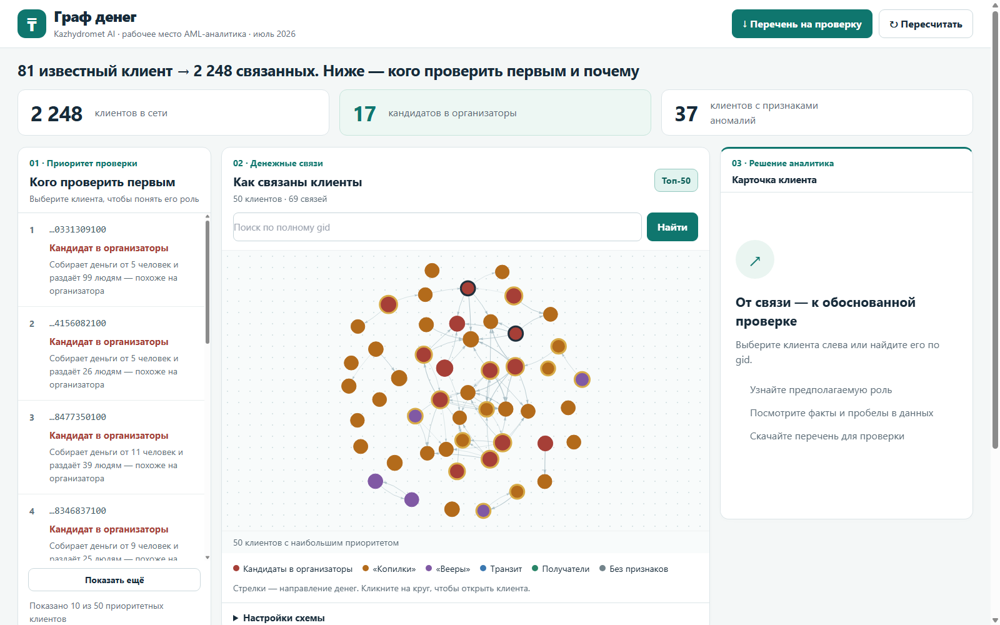
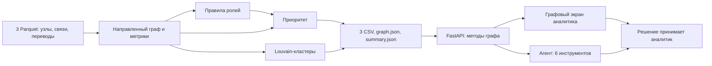

# Граф денег

HackAlem AI 2026 · кейс Freedom · команда Kazhydromet AI

AML-аналитику известен нижний уровень из 81 «курьера», а сеть переводов охватывает
**2 248 клиентов**. Инструмент показывает, кого проверить первым и на каких
наблюдаемых переводах основана гипотеза о роли каждого участника.
Роль и приоритет не означают виновность; решение принимает аналитик.

## 1. Что реализовано

- Один локальный запуск `app.pipeline` читает три Parquet-файла, строит
  направленный граф и создаёт три обязательных CSV, `graph.json` и `summary.json`.
  Результат: **2 248 узлов, 3 119 связей, 72 кластера и топ-50**.
  Исходные данные содержат **4 840 транзакций**. При контрольном запуске
  23.09.2026 расчёт занял **3,9 с**; свежий замер — поле `seconds`
  в `out/summary.json`. На другом ноутбуке время нужно измерить снова.
- Роли и приоритет задаются явными правилами. Для каждого узла записаны
  `role_score`, `priority_score`, кластер и объяснение с числами.
- Реализованы учёт обрыва четвёртого колена; доля исходящих переводов за
  0–2 дня после любого поступления; максимум разных плательщиков за день;
  направленные циклы длиной до шести и крупнейшая сильно связная компонента
  из **85 узлов**; расчёт размера крупнейшей компоненты после исключения
  топ-5, топ-10 и топ-20 узлов. Эти 85 узлов не образуют одно простое кольцо.
- Сервер предоставляет карточку узла с входящими и исходящими связями,
  датами и списком недостающих данных (`gaps`: что запросить у аналитика),
  общий список приоритетов, кластеры и путь по связям.
  Агент на OpenAI Agents SDK использует шесть инструментов для ответов по графу.
- Главный экран `web/index.html` объединяет схему сети, список приоритетов,
  карточку узла, кластеры и чат. `web/graph.html` остаётся запасным экраном
  с блоком устойчивости. Отдельный отчёт помогает передать аналитику
  перечень узлов и запросить недостающие сведения.

### Экран аналитика

Адрес <http://127.0.0.1:8000> открывает главный `web/index.html`:
`app/main.py` раздаёт папку `web/` с `html=True` и не перенаправляет `/`.
Ссылка `/#<gid>` открывает карточку конкретного узла. Запасной экран
доступен по `/graph.html` и тоже поддерживает `/graph.html#<gid>`.
Команды запуска ниже привязывают сервер
к `127.0.0.1`, поэтому он виден только с этого ноутбука.

- **Первый экран.** Три числа: **2 248 клиентов**, **17 кандидатов
  в организаторы**, **37 узлов с признаками аномалий**. Под ними — первые
  десять участников по приоритету и кнопка «Показать ещё». Каждая строка
  содержит роль словами и короткое объяснение `plain`; полный `gid`
  доступен при наведении и в карточке.
- **Схема сети.** Стрелки показывают направление перевода. По умолчанию
  виден топ-50; выбор узла показывает его прямых плательщиков и получателей,
  выбор кластера — узлы этой группы. Раскраска и «Вся сеть» находятся
  в свёрнутых «Настройках схемы». Вся сеть из 2 248 узлов может нагружать браузер.
- **Обозначения.** Цвет узла задаёт роль; можно переключить раскраску на
  кластеры. Чёрная рамка означает известного клиента (`seed`), золотая —
  принадлежность к крупнейшей сильно связной компоненте («кольцу
  возвратных потоков»), пунктир — обрыв исходящих на четвёртом колене.
  Размер узла отражает относительный приоритет.
- **Карточка.** Роль и простое объяснение, затем три факта: от скольких
  людей и сколько получил, скольким и сколько отправил, место в списке
  проверки. Ниже — «Почему такая роль», «Что проверить дальше» и аномалии.
  Остальные показатели находятся в свёрнутых «Подробных метриках».
- **Кластеры и чат.** Кластеры свёрнуты внизу экрана. Чат предлагает
  три подсказки, показывает ответ и вызванные инструменты;
  без ключа работает локальный демо-режим. На запасном
  `graph.html` есть также блок устойчивости после исключения топ-5,
  топ-10 и топ-20 узлов и поиск по однозначному суффиксу `gid`.
- **Отчёт.** Кнопка «Перечень на проверку» скачивает Markdown-файл
  через `GET /api/report?top=20`.



[Карточка координатора](docs/screenshots/coordinator.png) ·
[Пример аномалии](docs/screenshots/anomaly.png) ·
[Обрыв четвёртого колена](docs/screenshots/truncated.png)

[ТЗ](docs/case/TZ.md) · [План](docs/PLAN.md) ·
[Схема на один слайд](docs/SCHEME.md) · [Сценарий питча](docs/PITCH.md)

## 2. Быстрый старт

Нужен Python 3.12 или новее; на Windows используем `uv`.
Команды выполняются из корня репозитория.
После однократной установки пакетов **одна команда** пересчитывает результаты
из `data/raw/*.parquet` в `out/`. Интернет и ключ API для расчёта не нужны.

macOS / Linux:

```bash
python3 -m venv .venv
.venv/bin/python -m pip install -r requirements.txt
.venv/bin/python -m app.pipeline
```

Windows PowerShell:

```powershell
uv venv .venv
uv pip install --python .venv\Scripts\python.exe -r requirements.txt
.\.venv\Scripts\python.exe -m app.pipeline
```

Не пересоздавайте существующую `.venv` во время показа. Параметры расчёта:
`--data <папка>` и `--out <папка>`. Повторный запуск заменяет результаты
в выходной папке. Перед показом команда должна запустить тот же расчёт на
чистом окружении и зафиксировать время: требование ТЗ — **не более пяти минут**.

Запуск интерфейса на macOS / Linux:

```bash
.venv/bin/python -m uvicorn app.main:app --host 127.0.0.1 --port 8000
```

**Одна команда запуска экрана для жюри на Windows** после установки пакетов:

```powershell
.\run.ps1
```

Скрипт сначала пересчитывает исходные Parquet, затем запускает экран;
при ошибке расчёта сервер не запускается. Для отдельной проверки можно
задать порт: `.\run.ps1 -Port 8012`.
Адрес по умолчанию: <http://127.0.0.1:8000>. Остановить сервер: `Ctrl+C`.
Ключ для необязательных ответов модели задаётся только в `.env`;
образец `.env.example` содержит пустую переменную `OPENAI_API_KEY`.
Если ключа нет или запрос к API не удался, чат возвращает ответ
в демо-режиме (`mode: mock`) по локальным данным графа.
`/api/health` проверяет наличие ключа, но не успешность ответа модели.
Секретный ключ не добавлять в Git. Основной графовый экран загружает
Tailwind и vis-network из `web/vendor/`, поэтому CDN для схемы не нужен.

## 3. Как проверить

Из корня репозитория после установки зависимостей:

Windows PowerShell:

```powershell
.\.venv\Scripts\python.exe scripts\check_outputs.py
```

macOS / Linux:

```bash
.venv/bin/python scripts/check_outputs.py
```

Скрипт `scripts/check_outputs.py` выполняет **21 проверку** по основным
условиям ТЗ: пересчёт менее пяти минут, схема и полнота трёх CSV,
уникальность и покрытие `gid`, допустимость оценок, ранжирование топа
и отсутствие роли `terminal` у обрезанного четвёртого колена.
Он пересчитывает данные во временную папку и применяет проверки к двум
наборам: сохранённым `out/*.csv` и только что полученным CSV.
Результат каждого пункта объединяет оба набора; при любом `FAIL`
скрипт завершается с кодом 1. Два прогона **не сравниваются побайтно**.

Louvain получает `seed=42`, поэтому случайность кластеризации зафиксирована.
Это не гарантия побайтного совпадения всего `out/` с результатом чистого
клона: `summary.json` содержит время выполнения, а последние разряды
чисел и порядок строк с одинаковой оценкой могут отличаться. Проверяйте
значения и инварианты скриптом, а не равенство хешей файлов.

## 4. Выходные файлы

| Файл | Обязательные поля ТЗ | Что добавлено |
|---|---|---|
| `out/nodes_roles.csv` — 2 248 строк | `gid`, `role`, `role_score`, `cluster_id`, `priority_score`, `evidence` (до 200 символов) | `depth`, `is_seed`, `truncated`, степени и суммы входа/выхода, числа переводов, `pass_through`, PageRank, HITS, посредничество, метрики исходных клиентов, циклы, временные признаки, `anomaly_count`, `anomaly_flags` |
| `out/clusters.csv` — 72 строки | `cluster_id`, `n_nodes`, `n_seed`, `sum_kzt_internal`, `top_gids`, `hypothesis` | `roles` — число участников по каждой роли |
| `out/top_nodes.csv` — 50 строк | `rank`, `gid`, `role`, `priority_score`, `why` | `cluster_id`, `is_seed` |

`out/graph.json` содержит узлы с простым объяснением `plain`, направленные рёбра, пороги и расчёт
устойчивости; `out/summary.json` — счётчики и время. Они не заменяют CSV.
В JSON и API `gid` передаётся строкой: 18-значное число нельзя точно
представить обычным числом JavaScript.

Отчёт `out/report.md` создаётся **отдельно**, не командой `app.pipeline`:

```bash
.venv/bin/python -m app.report
```

На Windows: `.\.venv\Scripts\python.exe -m app.report`. По умолчанию отчёт
содержит топ-10; параметры `--top`, `--gids` (список через запятую) и
`--out` меняют выбор узлов и путь файла. `GET /api/report?top=10` скачивает
такой же Markdown-отчёт. В нём есть рейтинг, карточки узлов с метриками
и крупнейшими контрагентами, пробелы в данных, запросы для аналитика
и ограничения метода.

## 5. Критерии ролей

Источник истины: `THRESHOLDS` и `assign_role` в
[app/pipeline.py](app/pipeline.py). Правила проверяются **сверху вниз**:
первая подходящая ветка назначает единственную основную роль.
Здесь `I` и `O` — число разных отправителей и получателей; `A` и `B` —
наблюдаемые входящая и исходящая суммы; `p=B/A`;
`S` — число известных исходных клиентов в двух шагах выше;
`C=1` — член крупнейшей сильно связной компоненты;
`F` — доля исходящей суммы за 0–2 дня после любого поступления.
`min(1; x)` ограничивает оценку сверху единицей.

| Первая подходящая проверка | Роль | `role_score` | Фрагмент настоящего `evidence` |
|---|---|---|---|
| `I=0, O=0` | `peripheral` | 0,9 | «seed; нет переводов ≥5 000 ₸ внутри выгрузки» |
| `(I≥5 и O≥10) или (S≥3 и O≥3)` | `coordinator` | `min(1; 0,5+0,03I+0,005O+0,05S+0,1C)` | «собирает от 5 плательщ. (984 635 ₸), раздаёт 99 получ.» |
| `O≥10` | `distributor` | `min(1; 0,5+O/100)` | «46 переводов на 34 разных получателей, 3 002 628 ₸» |
| `I≥3` | `consolidator` | `min(1; 0,45+0,05I+0,1 при ≥3 разных плательщиках за день)` | «получает от 8 разных плательщиков (15 переводов, 2 160 500 ₸)» |
| `depth=4, O=0` | `peripheral`, `truncated=True` | 0,3 | «4-е колено: получил 2 226 000 ₸ от 1 плательщ.; исходящие не выгружались» |
| `I>0, O=0` и (`A≥100 000 ₸` или `I≥2`) | `terminal` | `min(1; 0,6+A/5 000 000)` | «получил 569 251 ₸ от 2 плательщ. (2 переводов), дальше ничего» |
| `I>0, O=0`, порог выше не достигнут | `peripheral` | 0,7 | «получил 70 020 ₸ (1 перев.) и дальше не переводил» |
| `I>0, O>0, p<0,2`, не seed | `terminal` | 0,55 | «дальше ушло лишь 51 800 ₸ (16%, 2 получ.)» |
| `O>0`, seed | `transit` | 0,45 | «seed: отправил 1 505 966 ₸ 4 получ.; входящие вне выгрузки — роль по исходящим» |
| `O>0, 0,5≤p≤2` | `transit` | `min(1; 0,55+0,4F−0,2abs(1−p))` | «отдал дальше 81% полученного (3 получ.); 85% суммы ушло за ≤2 дня» |
| `O>0, p>2` | `transit` | 0,35 | «отдал 1 668 800 ₸ при видимых входящих 192 930 ₸» |
| Остальные случаи | `peripheral` | 0,5 | «отдал дальше 34% полученного; ни сбора, ни веера, ни чистого транзита» |

Оценки округлены до трёх знаков; это сила правила, **не вероятность
преступления**. Таблица показывает применяемое правило, а не доказанную
природу операций. Суммы и количества переводов приводятся в `evidence`;
знаки направления учитываются в `I/O`, `A/B`.
Для seed входящая сумма неполна: коэффициент `p` в их роли не применяется.
Если `A=0`, `pass_through=-1` в CSV означает «не определён».

В текущем расчёте: **17 coordinator, 161 consolidator, 49 distributor,
367 transit, 401 terminal, 1 253 peripheral**. Все 2 248 узлов включены,
в том числе 19 исходных клиентов без единого видимого перевода.

## 6. Ловушки данных

1. **Обрыв четвёртого колена.** Из него исходящие не выгружались. У 444 узлов
   `truncated=True`: 441 получил `peripheral` с явной оговоркой, а 3 —
   `consolidator`, потому что правило `I≥3` стоит выше правила обрыва.
   Их дальнейшее движение неизвестно; по нулевым исходящим нельзя делать
   вывод об удержании средств. У узлов колен 0–3 исходящие вошли в выгрузку,
   поэтому отсутствие исходящих поддерживает гипотезу `terminal` в пределах
   банка, месяца и порога. У трёх `consolidator` четвёртого колена
   `evidence` прямо указывает: «исходящие не выгружались».
2. **Неполный вход у seed.** Поиск начинается от 81 известных клиентов;
   поступления извне графа не видны. Отношение `B/A` для них не используем.
   У остальных узлов входящие также могут быть неполными; `B/A>1`
   не доказывает «приумножение». При `B>A` (включая нулевой видимый вход)
   карточка предлагает запросить входящие вне выборки; для seed — всегда.
3. **Сумма и число переводов различаются.** Входящие/исходящие суммы
   и числа контрагентов влияют на роль и приоритет; `evidence` дополнительно
   показывает число отдельных переводов. Равный оборот может скрывать разную
   структуру операций.
4. **Направление.** Степени, роль, пути и PageRank вычисляются на направленном
   графе. Louvain для сообществ использует неориентированную проекцию;
   суммы встречных рёбер складываются. Анализ устойчивости тоже использует
   неориентированную проекцию: оценивает связность, а не движение денег.

## 7. Детекция аномалий

Это дополнительный пункт ТЗ: `anomaly_flags()` в `app/pipeline.py`
назначает наблюдательные флаги по трём правилам из `THRESHOLDS`.

| Флаг | Формальное условие |
|---|---|
| Дробление | У получателя не менее **5 входящих переводов**, и не менее **70%** из них на сумму **от 5 000 ₸ включительно до 10 000 ₸ не включительно**. |
| Повтор суммы | Один отправитель совершил **не менее 8 переводов на одинаковую сумму**; получатели могут быть разными. |
| Нетипичный оборот | Для узла `z-score` от `log1p(входящая + исходящая сумма)` среди узлов **того же колена** больше **2,5**. |

`anomaly_flags` в `out/nodes_roles.csv` содержит текст сработавших флагов
(или «нет»), `anomaly_count` — их число. В `out/summary.json`
`anomalies=37` означает **37 узлов хотя бы с одним флагом**, не 37
доказанных нарушений. Например, `100000000332284100` имеет один флаг
дробления: **10 из 12** входящих переводов на 5 000–9 999 ₸ от
**10 плательщиков**. Эти признаки помогают выбрать следующий запрос,
но **не участвуют в `assign_role()` или `priority()`** и не меняют
роль и приоритет узла. Главный экран показывает флаги в карточке узла.

## 8. Приоритет проверки

`priority()` считает предварительную оценку:

```text
P = 0,40 × вес_роли × role_score
  + 0,20 × процентиль(входящая + исходящая сумма)
  + 0,15 × процентиль(PageRank)
  + 0,15 × процентиль(seed в двух шагах выше)
  + 0,05 × процентиль(посредничество)
  + 0,05 × признак крупнейшей сильно связной компоненты
```

Веса ролей: `coordinator=1`, `consolidator=0,85`,
`distributor=0,75`, `transit=0,5`, `terminal=0,35`,
`peripheral=0,05`. Процентиль — относительное место в текущих
2 248 узлах. Известным seed-клиентам P умножается на **0,8**,
чтобы сместить внимание с уже известных «курьеров» на неизвестных
посредников и сборщиков. Для `truncated` тоже применяется ×0,8;
при обоих признаках множители перемножаются. После этого P делится
на максимум по сети и округляется до четырёх знаков. Это **приоритет
проверки**, не вероятность виновности; при другой выборке оценка изменится.

HITS (`hub`, `authority`) сохраняется как вспомогательная метрика:
он не входит в правила ролей и формулу приоритета. Номер кластера
Louvain также не влияет на роль или приоритет.

## 9. Кластеры и гипотезы

Сообщества строятся алгоритмом Louvain на неориентированной проекции
с весом `sum_kzt`, `seed=42` и `resolution=1`.
Кластер `0` объединяет 19 изолированных seed только для учёта в
результате: связи между ними не предполагаются. Остальные сообщества
нумеруются с 1 по убыванию размера; всего в результате **72 кластера**.

Для каждого кластера считаются размер, число исходных клиентов,
сумма переводов **внутри** кластера, пять первых узлов по приоритету
и состав ролей. `hypothesis` формируется из числа координаторов,
накопителей, распределителей и транзитных узлов, числа seed
(общая инфраструктура / цепочка одного seed / дальнее окружение)
и первого по приоритету узла. Это текстовое описание правил,
не независимое доказательство назначения кластера.
Кластеры — группы связей; роли — признаки отдельных участников.
Слабосвязных компонент **35 с учётом 19 изолированных**;
это другое разбиение, чем Louvain.

## 10. Архитектура и API



Реализованные методы FastAPI: `GET /api/overview`, `/api/graph`,
`/api/node/{gid}`, `/api/top?n=&role=`, `/api/clusters`,
`/api/clusters/{cluster_id}`, `/api/path?src=&dst=`,
`POST /api/recompute`, `POST /api/chat`, `GET /api/health`,
`GET /api/report?top=&gids=` (скачивание Markdown-отчёта).
Дополнительно сервер сохраняет методы табличного датасета и прежней
аналитики: `/api/summary`, `/api/anomalies`, `/api/refusals`,
`/api/dataset`, `POST /api/dataset/upload` и `POST /api/dataset/reset`.
`/api/overview` включает число узлов с аномалиями (`anomalies`).
`/api/graph` возвращает идентификаторы строкой и объяснения `plain`;
`/api/node/{gid}` даёт `plain`, `evidence`, соседей и `gaps`.
`/api/path` отдаёт до пяти кратчайших направленных путей
с признаком `chronology_ok`: маршрут считается возможным по времени
только при неубывающих датах отдельных переводов на каждом шаге.
Суммы переводов между шагами не сопоставляются, поэтому даже путь
с подходящими датами не доказывает движение именно тех же денег.
`/api/top` возвращает `plain`, `evidence`, `why` и глобальный `rank` даже при
фильтре по роли.

Шесть инструментов агента: `network_overview` (сводка и устойчивость),
`top_priority` (рейтинг), `node_card` (карточка и пробелы в данных),
`common_receivers` (общие получатели до трёх шагов),
`money_path` (структурная направленная цепочка) и
`cluster_info` (группа и гипотеза). При вопросе агента об общих
получателях он опирается на рассчитанный граф; в режиме `mock`
ответ формируется локально, без вызова языковой модели.
Инструмент `node_card` передаёт модели `metrics_glossary` со значениями
метрик: «отдал дальше» — отношение исходящей суммы к видимой входящей,
а «скорость транзита» — доля исходящей суммы за 0–2 дня после какого-либо
поступления. Инструкция агенту требует не смешивать эти показатели.
Живому ответу отведено не более 25 секунд; при таймауте или ошибке
возвращается локальный ответ по графу. `/api/chat` принимает непустую
историю до 50 сообщений с ролями `user`/`assistant` и текстовым `content`;
служебные роли из клиентского запроса не принимаются.

## 11. Три узла для проверки жюри

Все примеры взяты из сохранённого `out/top_nodes.csv` и сверены
с `out/nodes_roles.csv`. Они не зашиты в правила.

| Ранг, gid | Почему такая роль |
|---|---|
| **1**, `100000000331309100` | `coordinator`: 5 разных плательщиков, вход 984 635 ₸; 99 получателей, выход 23 001 375 ₸; 3 seed в двух шагах выше. Проходит первую составную проверку `I≥5, O≥10`. `role_score=1`, `priority_score=1`. Член крупнейшей сильно связной компоненты; через него проходит 32 найденных коротких цикла. |
| **11**, `100000003115284100` | `consolidator`: 8 плательщиков, 15 входящих переводов на 2 160 500 ₸, 2 получателя и выход 517 000 ₸; `I≥3`, предыдущие проверки не подходят. За один день было до 7 разных плательщиков. `role_score=0,95`, `priority_score=0,8715`. |
| **16**, `100000005933757100` | `distributor`: 4 плательщика и 34 получателя; 46 исходящих переводов на 3 002 628 ₸. Порог `O≥10` сработал раньше правила накопителя `I≥3`. `role_score=0,84`, `priority_score=0,8139`. |

При новом расчёте ранги могут измениться из-за равных или близких оценок;
перед выступлением сверить значения по свежим CSV. Жюри может назвать
любой `gid`: правила применяются ко всем 2 248 узлам.

## 12. Ограничения

Видны только внутрибанковские исходящие переводы на четыре колена
за **01.07.2026–31.07.2026**, с порогом **5 000 ₸**. Внешние и более
мелкие операции не видны, как и последующие переводы с четвёртого колена.
Нет ФИО, ИИН, остатков и размеченных правильных ролей (`ground truth`).
Правила и `role_score` не валидированы на реальных расследованиях.
«Признаки консолидации», «возможно требует проверки» — корректные формулировки;
обвинение и блокировка требуют решения человека. Общая сумма переводов
**365 890 012,01 ₸** — оборот рёбер, не уникальные деньги и не оценка ущерба.
Данные обезличены и предоставлены для хакатона.

Временной признак отмечает исходящий перевод, если перед ним за 0–2 дня
было **любое** поступление. Он не сопоставляет входящую и исходящую суммы,
поэтому не доказывает прохождение именно тех же средств.
Поиск общих получателей удаляет повторяющиеся входные `gid`;
на сцене всё равно лучше задавать пять разных участников.
Основной экран использует локальные библиотеки из `web/vendor/`;
для ответов внешней языковой модели сеть всё ещё нужна, но демо-режим
чата работает локально. Режим «вся сеть» может быть тяжёлым для браузера.

## 13. Масштабирование до миллиона узлов

Это план, а не уже реализованная производительность. Для крупного графа
нужны измерение памяти и потоковая обработка рёбер. NetworkX заменить
на igraph или graph-tool; полное посредничество убрать либо оценивать
по выборке из `k` узлов. Циклы искать только внутри сильно связных
компонент и с ограничением длины. Для устойчивых сообществ рассмотреть
Leiden вместо Louvain. Рёбра хранить в Parquet с аналитическими запросами
через DuckDB либо в графовой базе Neo4j — выбор зависит от сценария.
На экране показывать агрегированные кластеры и окрестность выбранного
участника вместо миллиона точек. Обещание пяти минут на этом масштабе
нужно подтверждать отдельным замером.

## 14. Технологии и вклад команды

Python, pandas, pyarrow, NetworkX, SciPy, FastAPI и OpenAI Agents SDK
используются в текущем коде. Оба графовых экрана (`index.html` и
`graph.html`) применяют vis-network и Tailwind и берут библиотеки
из `web/vendor/`.

**Codex и Claude Code — AI-агенты разработки** под контролем команды.
Согласно [истории проекта](docs/HISTORY.md), Ali с Claude Code подготовили
пайплайн ролей, кластеров и приоритета, API, агента с шестью инструментами,
запасной экран, офлайн-библиотеки, словарь метрик и флаги аномалий.
Ali с Codex подготовили валидатор, ревью и отчёт аналитика;
при финальной проверке Codex также упростил главный экран и сверил документацию.
Yerbu создал главный экран и раскладку графа, Abylaikhan — первоначальные
README, питч и вопросы жюри. Рабочий AML-ассистент на OpenAI Agents SDK
отвечает по инструментам графа; роли назначает детерминированный код.

[Состояние работ](docs/STATUS.md) · [Сценарий на пять минут](docs/PITCH.md).
