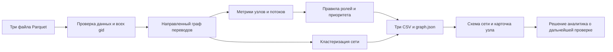

# Граф денег

HackAlem AI 2026 · кейс Freedom · команда Kazhydromet AI

Инструмент для специалиста банка по противодействию отмыванию денег (AML):
по сети переводов от известных исходных клиентов определить, кого проверять
первым и какие наблюдаемые признаки объясняют этот приоритет.
Роли являются гипотезами для проверки человеком, а не выводами о виновности.

## Готовность

Реализованы расчёт ролей, кластеры, приоритеты, три CSV и серверные методы графа.
Расчёт из версии `fbb8426` проверен 23.09.2026 на macOS 26.6.2 ARM64, Python 3.12.14:
полный запуск в отдельную временную папку занял **4,81 секунды** (4,4 секунды внутри
расчёта). Все 2 248 узлов покрыты, схемы CSV и оценки проверены, топ содержит 50 строк.
Это замер на подготовленном окружении, не проверка установки на чистой машине.

Графовый интерфейс ещё должен быть подключён командой к новым серверным методам:
текущая страница остаётся прежним приложением «ГосФин». Готовность расчёта не означает
готовность визуального показа. Внешний языковой помощник этим прогоном не проверялся.

[Задание](docs/case/TZ.md) · [План и контракт интерфейса](docs/PLAN.md) ·
[Статус команды](docs/STATUS.md) · [Вопросы заказчику](docs/QUESTIONS.md) ·
[Сценарий выступления](docs/PITCH.md)

## Подготовка на чистой машине

Нужны Git, uv и Python 3.12 (uv может установить Python при создании окружения).
Команды выполняются из корня репозитория. Интернет нужен для установки зависимостей.
Node.js и видеокарта для описанного Python-приложения не нужны.

```bash
git clone https://github.com/BAITC-Hacks/hack-b18c30d4-kazhydromet-ai.git hack
cd hack
uv venv --python 3.12 .venv
```

macOS / Linux:

```bash
uv pip install --python .venv/bin/python -r requirements.txt
```

Windows PowerShell:

```powershell
uv pip install --python .venv\Scripts\python.exe -r requirements.txt
```

Окружение создаётся один раз. Существующий `.env` не перезаписывать.
Для необязательного языкового помощника скопировать `.env.example` в `.env`,
если файла ещё нет, и заполнить ключ локально. Ключи не добавлять в Git.
Защита коммитов: `git config core.hooksPath .githooks`.

## Один запуск расчёта

После установки зависимостей выполнить одну команду из корня репозитория.
SciPy включена в requirements.txt: она необходима для PageRank и HITS в NetworkX.

macOS / Linux:

```bash
.venv/bin/python -m app.pipeline
```

Windows PowerShell:

```powershell
.venv\Scripts\python.exe -m app.pipeline
```

По умолчанию входные файлы находятся в `data/raw/`, результат записывается в `out/`.
Пути можно изменить параметрами `--data <папка>` и `--out <папка>`.
Повторный запуск перезаписывает результаты в указанной выходной папке.
Требование: полный локальный пересчёт всех трёх CSV не более чем за пять минут,
без ручных промежуточных действий и платных сервисов.
Измеренные 4,81 секунды относятся только к предоставленной выборке и указанному
окружению. При изменении данных или правил измерение нужно повторить.

## Запуск существующего веб-приложения

macOS / Linux:

```bash
.venv/bin/python -m uvicorn app.main:app --port 8000
```

Windows PowerShell:

```powershell
.venv\Scripts\python.exe -m uvicorn app.main:app --port 8000
```

Открыть <http://localhost:8000>. Остановка: `Ctrl+C`.
Проверка доступности: `curl http://localhost:8000/api/health`.
Поле `live` служебного ответа означает наличие ключа, а не успешный запрос к модели.
Фактический режим ответа чата указан в `mode`: `live` или `mock` (демонстрационный ответ).

Текущая страница ещё использует прежний сценарий госуслуг и внешние библиотеки
через CDN. Полностью автономная работа нового интерфейса без интернета пока
не подтверждена; перед сдачей нужно обеспечить локальную доступность библиотек.

## Данные и проверенные величины

Источник: файлы организаторов в `data/raw/`.
[Описание полей](data/raw/README.md). Проверено непосредственно по файлам 23.09.2026.

| Файл / показатель | Значение |
|---|---|
| `nodes.parquet` | 2 248 уникальных участников (`gid`) |
| `edges.parquet` | 3 119 уникальных направленных пар отправитель → получатель |
| `transactions.parquet` | 4 840 переводов |
| Исходные клиенты (`is_seed`) | 81 |
| Период | 01.07.2026–31.07.2026 |
| Общая сумма переводов внутри выгрузки | 365 890 012,01 ₸ |
| Узлы по коленам 0 / 1 / 2 / 3 / 4 | 81 / 472 / 462 / 789 / 444 |
| Изолированные узлы без рёбер | 19, все исходные клиенты |
| Исходные клиенты без исходящих | 31, включая 19 изолированных |
| Узлы четвёртого колена без исходящих | 444 |
| Слабосвязные компоненты с учётом изолированных узлов | 35 |
| Крупнейшие компоненты | 1 877 и 270 узлов |
| Вне крупнейшей компоненты | 371 узел |

Проверено: все концы рёбер присутствуют в таблице узлов; группировка транзакций
по паре отправитель–получатель совпадает с рёбрами по парам, суммам
(с учётом точности чисел) и количествам переводов.

Числа «16 компонент» и «352 узла вне крупнейшей компоненты» из задания совпадают
с графом без 19 изолированных участников. Для всей таблицы узлов это 35 и 371.
Изолированные участники тоже должны получить строку результата и `cluster_id`.
Компоненты связности и сообщества, выделяемые кластеризацией, — разные понятия.

Оборот не равен объёму уникальных денег или преступных доходов: одни средства
могут проходить через несколько рёбер.

## Схема решения

Состояние реализации указано в разделе «Готовность».



Для кластеризации используется неориентированная проекция: суммы встречных
переводов складываются. Louvain: вес = сумма, seed = 42, resolution = 1.
Сообщества нумеруются с 1 по убыванию размера; кластер 0 объединяет 19 изолированных
участников, не утверждая, что между ними есть связь. Получено 72 группы, включая 0.
Роли и метрики потоков рассчитываются по направленному графу.
Языковой помощник необязателен: он объясняет рассчитанные показатели,
а воспроизведение CSV не должно зависеть от ключа или внешней модели.

## Роли и правила

Источник правил: `THRESHOLDS`, `assign_role` и `priority` в [app/pipeline.py](app/pipeline.py),
версия `fbb8426`. Обозначения: I/O — число разных отправителей/получателей;
A/B — входящая/исходящая сумма; p = B/A; S — число исходных клиентов не далее
двух шагов выше по направлению потока; C = 1 для крупнейшей сильно связной компоненты,
иначе 0; F — доля исходящей суммы, для которой есть поступление за 0–2 дня до неё.

Правила проверяются **строго сверху вниз**, первая подходящая ветка задаёт роль.
Все суммы и связи относятся только к наблюдаемой выгрузке.

| Порядок | Условие | Роль | role_score |
|---|---|---|---|
| 1 | I = O = 0 | `peripheral` | 0,9 |
| 2 | (I ≥ 5 и O ≥ 10) или (S ≥ 3 и O ≥ 3) | `coordinator` | min(1; 0,5 + 0,03I + 0,005O + 0,05S + 0,1C) |
| 3 | O ≥ 10 | `distributor` | min(1; 0,5 + O/100) |
| 4 | I ≥ 3 | `consolidator` | min(1; 0,45 + 0,05I + 0,1 при ≥3 плательщиках в один день) |
| 5 | depth = 4 и O = 0 | `peripheral` с признаком обрыва | 0,3 |
| 6 | I > 0, O = 0, причём A ≥ 100 000 ₸ или I ≥ 2 | `terminal` | min(1; 0,6 + A/5 000 000) |
| 7 | I > 0, O = 0, условие 6 не выполнено | `peripheral` | 0,7 |
| 8 | I > 0, p < 0,2, узел не исходный | `terminal` | 0,55 |
| 9 | O > 0, узел исходный | `transit` | 0,45 |
| 10 | O > 0 и 0,5 ≤ p ≤ 2 | `transit` | min(1; 0,55 + 0,4F − 0,2 × abs(1 − p)) |
| 11 | O > 0 и p > 2 | `transit`, входящие могут быть неполными | 0,35 |
| 12 | Ни одна ветка выше не подошла | `peripheral` | 0,5 |

`role_score` округляется до трёх знаков и выражает эвристическую силу правила,
не статистически подтверждённую вероятность. Правильные роли не размечены.
На четвёртом колене накопитель может быть распознан по входящим до ветки 5,
но такие узлы не объявляются конечными получателями. Признак `truncated` сохраняется.
При отсутствии входящих отношение p в CSV записывается как −1 (не определено).
Даже на коленах 0–3 роль terminal — гипотеза в пределах месяца, банка и порога.

Приоритет до нормирования:

```text
P = 0,40 × W(role) × role_score
  + 0,20 × percentile(A + B)
  + 0,15 × percentile(PageRank)
  + 0,15 × percentile(S)
  + 0,05 × percentile(betweenness)
  + 0,05 × C
```

W: coordinator = 1; consolidator = 0,85; distributor = 0,75; transit = 0,5;
terminal = 0,35; peripheral = 0,05. `percentile` — относительный ранг среди всех
узлов, равные значения получают средний ранг; если максимум признака нулевой,
весь вклад равен нулю. PageRank взвешен суммами; посредничество (betweenness)
рассчитывается по направленным невзвешенным путям. Исходным клиентам и обрезанным
узлам P отдельно умножается на 0,8; при обоих признаках — на 0,64.
Далее P делится на максимальное значение и округляется до четырёх знаков.
Оценки относительные и могут меняться при изменении состава выгрузки.

Временной признак F не доказывает движение тех же денег: достаточно любого
поступления в предшествующие 0–2 дня, суммы операций не сопоставляются попарно.
Циклы ищутся до длины 6. HITS рассчитывается как дополнительная метрика,
но не входит напрямую в формулы роли или приоритета.

Результат проверенного прогона: 17 coordinator, 49 distributor, 161 consolidator,
367 transit, 401 terminal и 1 253 peripheral. Это классификация правил,
а не подтверждённое число преступных участников.

## Обязательные результаты

| Файл | Строки | Обязательные поля |
|---|---|---|
| `out/nodes_roles.csv` | Ровно 2 248, по одному на входной `gid` | `gid`, `role`, `role_score`, `cluster_id`, `priority_score`, `evidence` |
| `out/clusters.csv` | По одной на кластер | `cluster_id`, `n_nodes`, `n_seed`, `sum_kzt_internal`, `top_gids`, `hypothesis` |
| `out/top_nodes.csv` | Не менее 20, по убыванию приоритета | `rank`, `gid`, `role`, `priority_score`, `why` |

Оценки находятся в диапазоне 0–1; объяснения непустые и содержат проверяемые числа.
`evidence` не длиннее 200 символов. Кластеры покрывают все входные узлы.
Дополнительные колонки допустимы. `out/graph.json` используется для интерфейса,
`out/summary.json` содержит сводку; оба не заменяют три обязательных CSV.
В CSV идентификаторы целочисленные, а в JSON передаются строками: 18-значный gid
нельзя безопасно преобразовывать в обычное число JavaScript.

### Примеры для проверки и показа

| gid | Роль и основание в проверенном результате |
|---|---|
| `100000000331309100` | coordinator: 5 отправителей, 99 получателей, 3 исходных клиента в двух шагах выше; приоритет 1 |
| `100000005933757100` | distributor: 46 переводов 34 получателям на 3 002 628 ₸; приоритет 0,8139 |
| `100000005075949100` | peripheral: четвёртое колено, поступило 2 226 000 ₸, дальнейшие переводы не выгружены; role_score 0,3 |

Это примеры из расчёта, не зашитые в алгоритм ответы. Перед показом проверить
их по свежему результату после обновлений команды.

## Ограничения

- Видны только внутрибанковские исходящие переводы на четыре колена за один месяц.
  Невидимые входящие потоки и последующие переводы нельзя считать нулевыми.
- На четвёртом колене нулевые исходящие могут объясняться границей выгрузки.
  Признак неполноты нужно показывать вместе с ролью.
- У исходных клиентов входящие занижены; `out_kzt / in_kzt` не является полным балансом.
- Переводов ниже 5 000 ₸ нет. Дробление под этот порог здесь не наблюдается.
- Нет ФИО, ИИН, доходов, остатков и подтверждённых ролей.
  Внешнее обогащение и выдуманные сведения недопустимы.
- Большая сумма и высокая связность сами по себе не доказывают преступление.
  Окончательное решение и запрос сведений делает специалист.
- Данные разрешены для использования в рамках хакатона. Перед передачей сведений
  внешнему языковому помощнику нужно сверить допустимость с условиями организаторов.

## Масштабирование до миллиона узлов

Это план развития, не реализованный результат. Нужно измерить объём рёбер и память,
хранить таблицы по частям в Parquet и читать только нужные колонки. Объекты NetworkX
могут стать узким местом; графовые операции стоит перенести в igraph или другой
движок с компактным хранением.

Степени и суммы рассчитываются агрегированием рёбер. Дорогие глобальные метрики
ограничить отдельными компонентами или приближёнными вычислениями; полный перебор
путей и циклов недопустим. В браузере показывать группы и окружение выбранного
узла, а не миллион вершин одновременно. Расчёт выполнять отдельным заданием,
сохраняя версии данных, правил и результатов. Время на таком масштабе нужно
измерить; переносить лимит пяти минут автоматически нельзя.

## Перед сдачей

1. Подключить графовый интерфейс и обновить раздел о готовности.
2. После изменений расчёта повторно сверить правила, пороги и формулы с кодом.
3. На чистом окружении выполнить команду расчёта и записать время.
4. Проверить покрытие всех `gid`, схемы CSV, диапазоны оценок и объяснения.
5. Показать поиск произвольного `gid`, направление связей и основание роли.
6. Прогнать пятиминутный сценарий из `docs/PITCH.md`, проверить работу без ключа.

## Участие Codex

Codex помог подготовить окружение, проверить состав и согласованность данных,
обновить документацию, вопросы заказчику и сценарий выступления.
Вклад в расчёт и интерфейс команда описывает по фактически выполненной работе.
