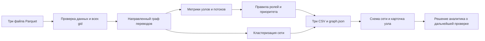

# Граф денег

HackAlem AI 2026 · кейс Freedom · команда Kazhydromet AI

Инструмент для специалиста банка по противодействию отмыванию денег (AML):
по сети переводов от известных исходных клиентов определить, кого проверять
первым и какие наблюдаемые признаки объясняют этот приоритет.
Роли являются гипотезами для проверки человеком, а не выводами о виновности.

## Готовность

Доступны данные организаторов, стартовый код, план и прежнее приложение «ГосФин».
Расчёт `app/pipeline.py`, роли, кластеры и графовый интерфейс пока в разработке.
Запуск прежнего приложения не подтверждает выполнение кейса «Граф денег».
Перед сдачей обновить этот раздел по результатам полного прогона.

[Задание](docs/case/TZ.md) · [План и контракт интерфейса](docs/PLAN.md) ·
[Статус команды](docs/STATUS.md) · [Вопросы заказчику](docs/QUESTIONS.md) ·
[Сценарий выступления](docs/PITCH.md)

## Подготовка на чистой машине

Нужны Git, uv и Python 3.12 (uv может установить Python при создании окружения).
Команды выполняются из корня репозитория. Интернет нужен для установки зависимостей.
Node.js и видеокарта для описанного Python-приложения не нужны.

```bash
git clone https://github.com/BAITC-Hacks/hack-b18c30d4-kazhydromet-ai.git hack
cd hack
uv venv --python 3.12 .venv
```

macOS / Linux:

```bash
uv pip install --python .venv/bin/python -r requirements.txt
```

Windows PowerShell:

```powershell
uv pip install --python .venv\Scripts\python.exe -r requirements.txt
```

Окружение создаётся один раз. Существующий `.env` не перезаписывать.
Для необязательного языкового помощника скопировать `.env.example` в `.env`,
если файла ещё нет, и заполнить ключ локально. Ключи не добавлять в Git.
Защита коммитов: `git config core.hooksPath .githooks`.

## Один запуск расчёта: согласованный интерфейс

Следующая команда предусмотрена планом, но пока не работает без разрабатываемого
`app/pipeline.py`. Это инструкция для завершённой реализации, а не подтверждение
успешного запуска текущей версии.

macOS / Linux:

```bash
.venv/bin/python -m app.pipeline
```

Windows PowerShell:

```powershell
.venv\Scripts\python.exe -m app.pipeline
```

По плану входные файлы находятся в `data/raw/`, результат записывается в `out/`.
Требование: полный локальный пересчёт всех трёх CSV не более чем за пять минут,
без ручных промежуточных действий и платных сервисов.
Фактическое время и проверенную версию нужно записать после публикации расчёта.
До этого обещание «работает за секунды» не подтверждено.

## Запуск существующего веб-приложения

macOS / Linux:

```bash
.venv/bin/python -m uvicorn app.main:app --port 8000
```

Windows PowerShell:

```powershell
.venv\Scripts\python.exe -m uvicorn app.main:app --port 8000
```

Открыть <http://localhost:8000>. Остановка: `Ctrl+C`.
Проверка доступности: `curl http://localhost:8000/api/health`.
Поле `live` служебного ответа означает наличие ключа, а не успешный запрос к модели.
Фактический режим ответа чата указан в `mode`: `live` или `mock` (демонстрационный ответ).

Текущая страница ещё использует прежний сценарий госуслуг и внешние библиотеки
через CDN. Полностью автономная работа нового интерфейса без интернета пока
не подтверждена; перед сдачей нужно обеспечить локальную доступность библиотек.

## Данные и проверенные величины

Источник: файлы организаторов в `data/raw/`.
[Описание полей](data/raw/README.md). Проверено непосредственно по файлам 23.09.2026.

| Файл / показатель | Значение |
|---|---|
| `nodes.parquet` | 2 248 уникальных участников (`gid`) |
| `edges.parquet` | 3 119 уникальных направленных пар отправитель → получатель |
| `transactions.parquet` | 4 840 переводов |
| Исходные клиенты (`is_seed`) | 81 |
| Период | 01.07.2026–31.07.2026 |
| Общая сумма переводов внутри выгрузки | 365 890 012,01 ₸ |
| Узлы по коленам 0 / 1 / 2 / 3 / 4 | 81 / 472 / 462 / 789 / 444 |
| Изолированные узлы без рёбер | 19, все исходные клиенты |
| Исходные клиенты без исходящих | 31, включая 19 изолированных |
| Узлы четвёртого колена без исходящих | 444 |
| Слабосвязные компоненты с учётом изолированных узлов | 35 |
| Крупнейшие компоненты | 1 877 и 270 узлов |
| Вне крупнейшей компоненты | 371 узел |

Проверено: все концы рёбер присутствуют в таблице узлов; группировка транзакций
по паре отправитель–получатель совпадает с рёбрами по парам, суммам
(с учётом точности чисел) и количествам переводов.

Числа «16 компонент» и «352 узла вне крупнейшей компоненты» из задания совпадают
с графом без 19 изолированных участников. Для всей таблицы узлов это 35 и 371.
Изолированные участники тоже должны получить строку результата и `cluster_id`.
Компоненты связности и сообщества, выделяемые кластеризацией, — разные понятия.

Оборот не равен объёму уникальных денег или преступных доходов: одни средства
могут проходить через несколько рёбер.

## Схема решения

Планируемая архитектура; состояние реализации указано в разделе «Готовность».



Для кластеризации планируется неориентированная проекция графа.
Расчёты входящих и исходящих потоков должны сохранять направление.
Языковой помощник необязателен: он объясняет рассчитанные показатели,
а воспроизведение CSV не должно зависеть от ключа или внешней модели.

## Роли и правила

Окончательные пороги, порядок применения правил, формулы `role_score` и
`priority_score` пока не опубликованы в коде. Их фиксирует автор расчёта.
Перед сдачей таблицу необходимо сверить с реализацией.
Сейчас обязательный пункт о формальных правилах ещё не закрыт.

| Роль | Что должен объяснить расчёт | Состояние порогов |
|---|---|---|
| `consolidator` — накопитель | Поступления от нескольких участников, концентрация наблюдаемых средств | Ожидаются из реализации |
| `transit` — транзит | Передача средств дальше; отношение исходящих к входящим с учётом неполноты | Ожидаются из реализации |
| `distributor` — распределитель | Переводы многим различным получателям | Ожидаются из реализации |
| `terminal` — конечный получатель | Признаки удержания средств; обрыв четвёртого колена не является доказательством | Ожидаются из реализации |
| `coordinator` — предполагаемый координатор | Структурная значимость и связь с потоками; недостаточно одной большой суммы | Ожидаются из реализации |
| `peripheral` — периферия | Недостаточно признаков остальных ролей; по плану сюда входят узлы без рёбер | Ожидается подтверждение кода |

Для каждой роли нужны признаки, численные пороги, исключения, порядок выбора при
совпадении нескольких правил и пример `gid` из результата.
Правильные роли в данных не размечены. Оценку 0–1 нельзя представлять как
проверенную вероятность виновности.

## Обязательные результаты

| Файл | Строки | Обязательные поля |
|---|---|---|
| `out/nodes_roles.csv` | Ровно 2 248, по одному на входной `gid` | `gid`, `role`, `role_score`, `cluster_id`, `priority_score`, `evidence` |
| `out/clusters.csv` | По одной на кластер | `cluster_id`, `n_nodes`, `n_seed`, `sum_kzt_internal`, `top_gids`, `hypothesis` |
| `out/top_nodes.csv` | Не менее 20, по убыванию приоритета | `rank`, `gid`, `role`, `priority_score`, `why` |

Оценки находятся в диапазоне 0–1; объяснения непустые и содержат проверяемые числа.
`evidence` не длиннее 200 символов. Кластеры покрывают все входные узлы.
Дополнительные колонки допустимы. `out/graph.json` запланирован для интерфейса
и не заменяет три обязательных CSV.

## Ограничения

- Видны только внутрибанковские исходящие переводы на четыре колена за один месяц.
  Невидимые входящие потоки и последующие переводы нельзя считать нулевыми.
- На четвёртом колене нулевые исходящие могут объясняться границей выгрузки.
  Признак неполноты нужно показывать вместе с ролью.
- У исходных клиентов входящие занижены; `out_kzt / in_kzt` не является полным балансом.
- Переводов ниже 5 000 ₸ нет. Дробление под этот порог здесь не наблюдается.
- Нет ФИО, ИИН, доходов, остатков и подтверждённых ролей.
  Внешнее обогащение и выдуманные сведения недопустимы.
- Большая сумма и высокая связность сами по себе не доказывают преступление.
  Окончательное решение и запрос сведений делает специалист.
- Данные разрешены для использования в рамках хакатона. Перед передачей сведений
  внешнему языковому помощнику нужно сверить допустимость с условиями организаторов.

## Масштабирование до миллиона узлов

Это план развития, не реализованный результат. Нужно измерить объём рёбер и память,
хранить таблицы по частям в Parquet и читать только нужные колонки. Объекты NetworkX
могут стать узким местом; графовые операции стоит перенести в igraph или другой
движок с компактным хранением.

Степени и суммы рассчитываются агрегированием рёбер. Дорогие глобальные метрики
ограничить отдельными компонентами или приближёнными вычислениями; полный перебор
путей и циклов недопустим. В браузере показывать группы и окружение выбранного
узла, а не миллион вершин одновременно. Расчёт выполнять отдельным заданием,
сохраняя версии данных, правил и результатов. Время на таком масштабе нужно
измерить; переносить лимит пяти минут автоматически нельзя.

## Перед сдачей

1. Получить расчёт и обновить разделы «в разработке».
2. Сверить правила, пороги и формулы с кодом.
3. На чистом окружении выполнить команду расчёта и записать время.
4. Проверить покрытие всех `gid`, схемы CSV, диапазоны оценок и объяснения.
5. Показать поиск произвольного `gid`, направление связей и основание роли.
6. Прогнать пятиминутный сценарий из `docs/PITCH.md`, проверить работу без ключа.

## Участие Codex

Codex помог подготовить окружение, проверить состав и согласованность данных,
обновить документацию, вопросы заказчику и сценарий выступления.
Вклад в расчёт и интерфейс команда описывает по фактически выполненной работе.

