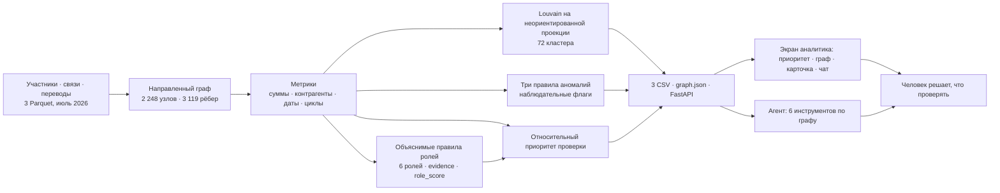

# «Граф денег»: схема решения

1. Источник — обезличенные внутрибанковские переводы от 81 известных клиентов на четыре колена; операции ниже 5 000 ₸ не входят в выборку.
2. Роли и объяснения строятся из направленных связей, сумм, числа контрагентов, дат и признаков циклов. Оценка роли выражает силу правила, а не вероятность виновности; флаги аномалий роль не меняют.
3. Louvain объединяет связанные узлы на неориентированной взвешенной проекции; кластер описывает группу, роль — отдельного участника. Номер кластера не входит в приоритет.
4. Приоритет ранжирует узлы для работы аналитика; исходные клиенты получают множитель 0,8, чтобы внимание перешло к ещё не изученным участникам.
5. Один локальный запуск создаёт три обязательных CSV, JSON для графа и сводку. API и шесть инструментов агента читают результаты; языковая модель необязательна.
6. Главный экран показывает приоритет, связи, карточку и чат; библиотеки схемы лежат в `web/vendor/` и работают без интернета. Аналитик проверяет гипотезы и решает, какие сведения запросить.
