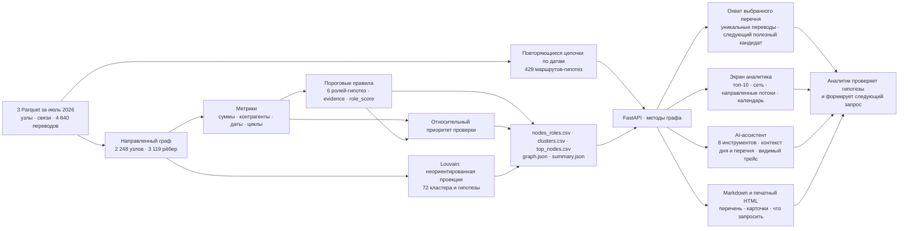

# «Граф денег»: схема решения

1. **Источник.** Обезличенные внутрибанковские переводы от 81 известных клиентов
   по исходящим на четыре шага. Период 01.07.2026–31.07.2026; операции ниже
   5 000 ₸ отсутствуют. 19 seed без переводов тоже включены в результат.
2. **Роли.** Направление, суммы, количество контрагентов и переводов,
   временные признаки и циклы дают объяснение для каждого gid.
   Роль — гипотеза; `role_score` выражает силу правила, а не вероятность виновности.
   У 444 узлов четвёртого колена исходящие неизвестны: это явно помечено.
3. **Приоритет.** Формула использует роль, оборот, PageRank, близость seed,
   посредничество и крупнейшую сильно связную компоненту. Seed и узлы
   с обрывом получают множитель 0,8 каждый. Кластер, HITS и флаги аномалий
   в приоритет не входят. 37 узлов имеют хотя бы один флаг аномалии.
4. **Кластеры.** Louvain считает сообщества на неориентированной проекции
   с весом суммы; встречные суммы складываются, `seed=42`. Кластер 0 —
   19 изолированных seed для полноты учёта, остальные 71 — сообщества.
   Номер кластера не назначает роль и не меняет приоритет.
5. **Воспроизводимость.** Одна команда `.\.venv\Scripts\python -m app.pipeline`
   создаёт обязательные CSV и JSON. `scripts/check_outputs.py` проверяет
   сохранённые и свежие выгрузки, все gid, оценки, объяснения и время < 300 с.
   Отчёт формируется отдельно: `python -m app.report` или `/api/report`; печатная версия — `/api/report/view`.
   `scripts/verify.py` объединяет 21 проверку выгрузок и 24 HTTP-проверки, сохраняет JSON с результатами и SHA-256.
6. **Экран и AI.** Главный адрес `/`: топ-10, схема топ-50, поиск полного gid,
   карточка с тремя фактами, причинами и пробелами данных; подробности свёрнуты.
   Tailwind и vis-network локальны в `web/vendor/`; запасной экран — `/graph.html`.
   Агент получает факты через инструменты графа, вызовы видны в чате.
   Внешняя модель необязательна: без ключа или при ошибке API отвечает локальный `mock`.
7. **Результат для аналитика.** «Перечень на проверку» сохраняет до 100 выбранных клиентов
   с карточками и перечнем недостающих сведений; топ-20 доступен как отправная точка. В карточке можно выгрузить
   один выбранный gid. Аналитик проверяет основания и готовит запрос;
   отправка в правоохранительные органы автоматически не производится.
8. **Границы вывода.** Входящие могут быть неполными; «отправил больше»
   не означает «приумножил». 85 узлов в крупнейшей сильно связной компоненте
   не образуют один простой цикл. Пути и общие получатели описывают связи;
   проверка неубывающих дат не доказывает происхождение тех же средств.
9. **Повторяющиеся маршруты.** `app/routes.py` сопоставляет отдельные переводы
   по датам и находит 429 цепочек A→B→C с минимум двумя независимыми парами.
   Они доступны через `/api/routes` и карточку; не меняют роли и приоритеты.
