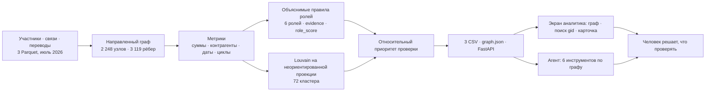

# «Граф денег»: схема решения

1. Источник — обезличенные внутрибанковские переводы от 81 известных клиентов на четыре колена; операции ниже 5 000 ₸ не входят в выборку.
2. Роли и объяснения строятся из направленных связей, сумм, числа контрагентов, дат и признаков циклов. Оценка роли выражает силу правила, а не вероятность виновности.
3. Louvain объединяет связанные узлы на неориентированной взвешенной проекции; кластер описывает группу, роль — отдельного участника.
4. Приоритет ранжирует узлы для работы аналитика; исходные клиенты получают множитель 0,8, чтобы внимание перешло к ещё не изученным участникам.
5. Один локальный запуск создаёт три обязательных CSV, JSON для графа и сводку. API и шесть инструментов агента читают результаты; языковая модель необязательна.
6. Графовый экран показывает связи, карточку и чат; для схемы нужны библиотеки из внешней сети. Аналитик проверяет гипотезы и решает, какие дополнительные сведения запросить.
